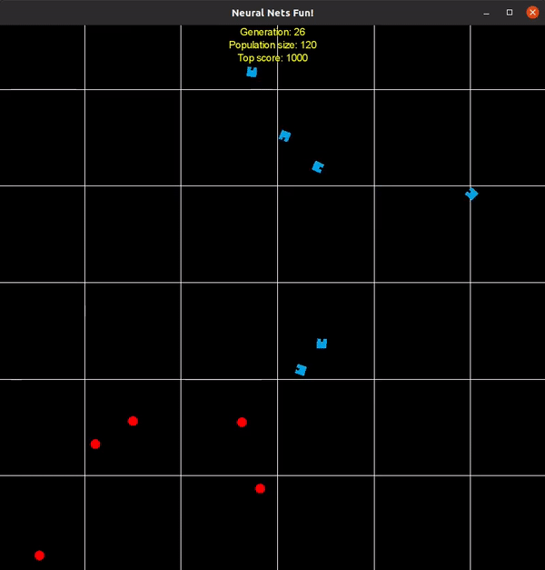

# stupid-food-collectors
ANN agents compete to collect food while mother nature works its magic to evolve them.

Simple Feed Forward ANN that can see, move and shoot each others. Also a basic genetic algorithm to evolve the population of ANN.
This project is written in Java 8 using libgdx, you can import it into any IDE as a graddle project.

This project uses no external GA/ANN libraries I coded everything from scratch to get a better feeling for these concepts.

Things currently working:
1. ANN agents almost completly done:
    a. Can be initialized with any network structure (number of layers and the size of each)
    b. Can be activated with an input array
    c. Can take actions like moving and shooting based on the ANN output
2. Basic GA, it is working fine but no fancy features
3. Basic graphics, agent sprite is a square while the food sprite is a red circle.
4. Stats tracking for the agents performance
5. The dna of an agent can be saved and loaded to/from a serializable file

Things I am working on:
1. ~~Camera control to zoom in/out and move the camera around the world~~
2. Simulation time speed control
3. Add new activation functions like ReLu, currently only a sigmoid function is defined

Future plans might be:
1. Add a menu to configure things (ANN agents, GA parameters, World) before starting the game
1. Put the main logic behind an API so that other simple games with new rules and agents can be created quickly
2. Upgrade the graphics

### Controls
* Arrow keys to move the camera
* Right **SHIFT** and **CTRL** to zoom in and out

